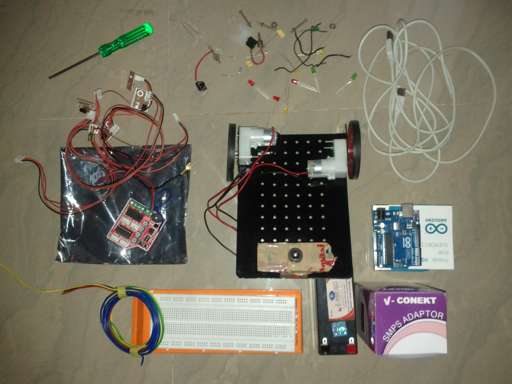

Arduino Robotics Workshop
=========================

This repo contains the source code samples and other files that I use for my [Robotics using Arduino workshop](http://hardwarefun.com/arduino-workshop).

About Workshop
-------------

I conduct an Arduino workshop which consists of hands-on sessions, where you can learn about Arduino and then use that knowledge to build a fully autonomously bot from scratch.

You can find the dates for the next batch and other details about the workshop [here](http://hardwarefun.com/arduino-workshop).

File structure
-------------

The following is the rough details about the different files present in this repo.

- Digital - This folder contains sample code explaining Arudino's digital functions
    - DigitalRead
    - DigitalWrite
- Analog - This folder contains sample code explaining Arudino's analog functions
    - AnalogRead
    - AnalogWrite
- Serial - This folder contains sample code explaining Arudino's serial and Software serial functions
    - SerialPrint
    - SerialWrite
    - two_arduino_serial - sketch which explains how to make two Arduino's talk to each other through serial
- IR - This folder contains sample code explaining how to use IR sensors
    - TestIR
- Interrupts
    - SoftwareInterrupts
    - HardwareInterrupts
- Timers
- Bot - This folder contains sample code controlling the bot which you will be using during the workshop
    - BasicBot
    - BasicBotUsingLibrary
    - BotWithInterrupt 
- UserContributed - List of sketches which the students came up during the workshop.

Presentations
-------------

The presentations that I use for my workshop are available in my [slideshare account](http://www.slideshare.net/Sudar/).

- [Day 1](http://www.slideshare.net/Sudar/arduino-robotics-workshop-day1)
- [Day 2](http://www.slideshare.net/Sudar/arduino-robotics-workshop-day2)

Kit
-------------

The following is the kit that I provide as part of my workshop.

License
-------

The source code is released under "THE BEER-WARE" license.

If you find this helpful, then I would appreciate if you could help spread the word about my [Arduino Robotics workshop](http://hardwarefun.com/arduino-workshop).

You can also find other ways to [make me happy](http://sudarmuthu.com/if-you-wanna-thank-me), if you liked this project ;)

Contributions
-------

All contributions (even documentation) are welcome :)

If you would like to contribute to this project, then just fork it in github and send a pull request. 
